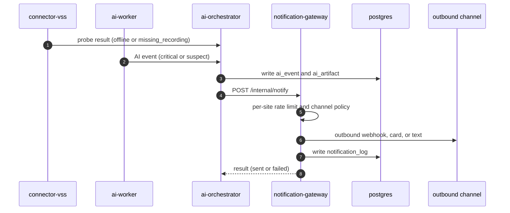
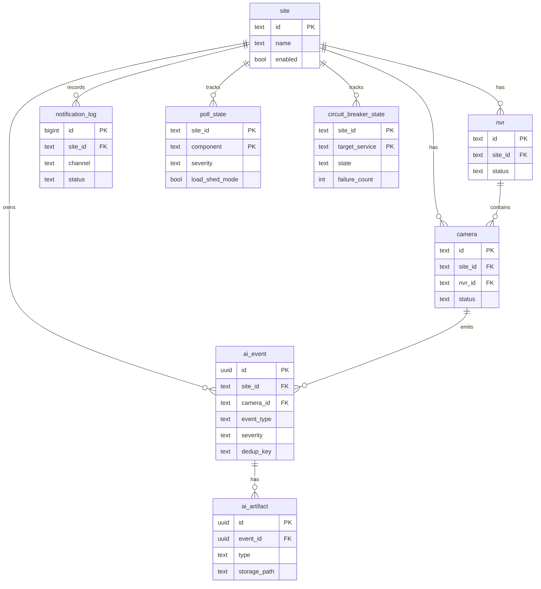
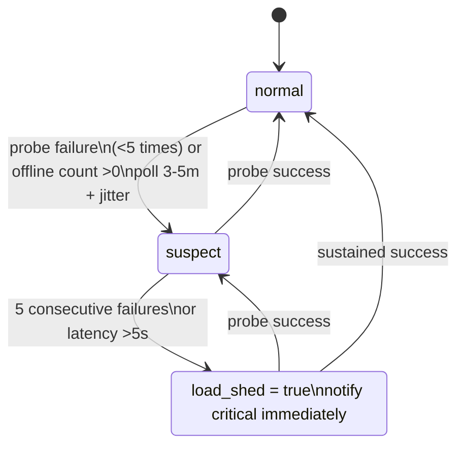

# ARCHITECTURE

## High-Level Components

- `connector-vss`: polling and device status sampling
- `ai-worker`: event producer
- `ai-orchestrator`: event ingest and persistence
- `notification-gateway`: only notification egress point
- `reporting-engine`: anomaly and ranking reports
- `scheduler`: periodic check and trigger workflows
- `web-dashboard`: dashboard summary API
- `shared`: shared utilities and types

## Runtime Topology

- Ports: gateway 3010, orchestrator 3011, worker 3012, connector 3013, reporting 3014, scheduler 3015, dashboard 3016.
- All services share PostgreSQL and (optionally) Redis; no cross-service DB access other than orchestrator/reporting/dashboard reading the same DB.
- Notification flows must go only through `notification-gateway` (`POST /internal/notify`).

## Data Flow

1. connector-vss and ai-worker generate signals/events.
2. ai-orchestrator persists events and artifacts.
3. ai-orchestrator and scheduler call notification-gateway.
4. reporting-engine and web-dashboard read site-scoped data from PostgreSQL.
5. all services expose metrics to Prometheus; Grafana visualizes.

## Database Schema (must include site_id)

- `site(id, name, enabled)`
- `nvr(id, site_id, name, status)`
- `camera(id, site_id, nvr_id, name, status, last_seen_at)`
- `ai_event(id, site_id, camera_id, event_type, severity, score, ts_event, dedup_key, metadata_json)`
- `ai_artifact(id, event_id, type, storage_path, metadata_json)`
- `notification_log(id, site_id, channel, severity, status, target, payload, error_message, created_at)`
- `poll_state(site_id, component, severity, next_poll_at, last_latency_ms, consecutive_failures, load_shed_mode)`
- `circuit_breaker_state(site_id, target_service, state, failure_count, last_failure_at, last_latency_ms, opened_at)`

## Isolation

- Every business table includes `site_id`.
- Every query path is site-scoped.
- Cross-site query patterns are rejected by design.

## Polling & State Machine

- Normal: poll every 3-5 minutes with +/-60s jitter.
- Suspect: poll every 1 minute.
- Critical: immediate notification path; may enter load shed.
- Transition triggers:
  - 5 consecutive API failures or latency > 5s -> breaker open, severity critical.
  - Recovery on successful probe lowers severity and closes breaker.
- State is persisted in `poll_state` and `circuit_breaker_state` for observability and restart safety.

## Reliability Controls

- Retry + backoff wrappers in shared HTTP helper
- Circuit breaker state tracking
- Load shedding toggles via env
- Health and metrics endpoints in all services

## Notification Pipeline

- Upstream services call only `notification-gateway` (`POST /internal/notify`).
- Per-site policy from `config/gateway/gateway.json.example`: `enabled`, `channels`, `rateLimitPerSitePerMin`, `gchat mode`, outbound routes.
- Cards mode supports summary/top20/links with auto-slicing (buttonsPerCard=6).
- Success/failure logged to `notification_log`; Prometheus metrics `vmm_notification_sent_total` and `vmm_notification_failed_total`.

### Alert Path (sequence)

### Database ER (logical)

## Observability

- Metrics: Prometheus scrapes each service `/metrics`.
- Key metrics: camera/nvr online/offline, ai_events_total, notification_sent/failed, api latency histogram, db pool gauge.
- Grafana dashboard provisioned from `config/grafana/dashboards/vmm-overview.json`.
- Health: each service exposes `/healthz`; `stack:wait` and CI smoke rely on these.

### Polling State Machine

## Deployment & Ops

- Standard stack via `docker compose` with restart policies and healthchecks.
- One-command helpers:
  - `stack:up|wait|status|smoke|diag|clean`
  - `doctor`, `verify`
- Release automation: tag `v*` triggers release workflow; `release:cut` prepares changelog + tag locally.